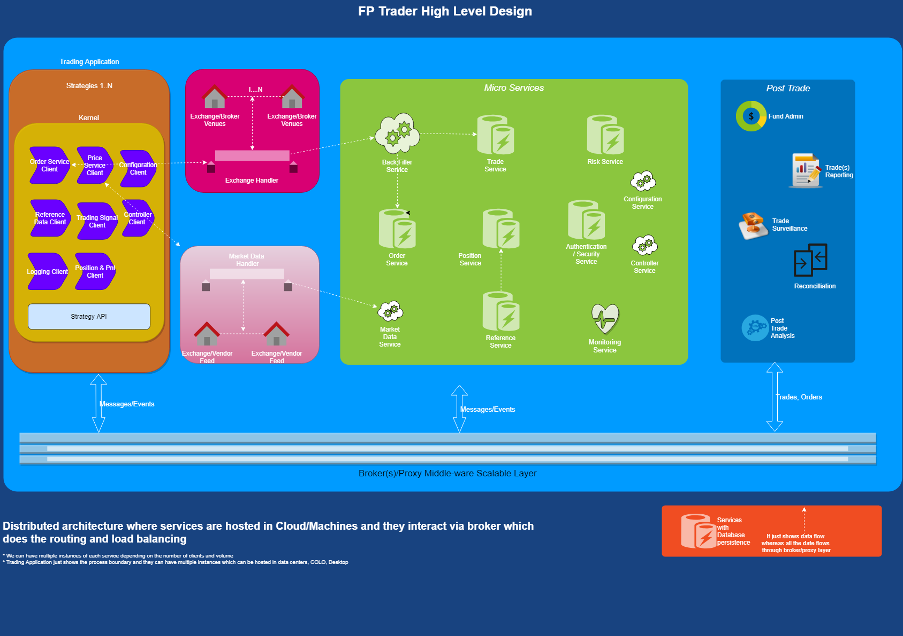

# FPTrader
Open Source Algo Trading Platform to trade various financial products (Equity/Future/FX/Index/Baskets)

 Building a trading platform from scratch can be very time-consuming, frustrating and risky.Without a trading platform source code 
 you are dealing with the black box.
 
 FPTrader's is a container engine which manages your portfolio and data feeds letting you 
 focus on your algorithm strategy and execution. 
 Data is piped into your strategy for you to analyze and place trades.

 FPTrader supports C# and Python  programming languages making  a truly open platform which can be run on linux or Windows.
 All CPU-intensive processes are asynchronous, taking full advantage of multi-core processors. 
 Data loading,message processes make full use of asynchronous programming design.
 
 FP Trader is Flexible, Customizable and Performant. It will  work for retail trading, professional trading, automated trading, black box trading and more.  No matter if you are a brokerage, professional trader, hedge fund or prop trader, this will provide an interface for trading.
     
     Features 
      - Professional charting and technical analysis.
      - Real time stock, futures and forex quote screens.
      - Easy-to-use APIs for market data, back testing and automated trading.
      - Minimum clicks to enable Trading
      - Orders can be routed to any destination.
      - Any data provider can be implemented. ( Reuters/Bloomberg/Exchange Feed)
      - All windows, toolbars, menus, charts and other features are completely customizable.
      - Containers can be run on exchange co locations.
      
      Cross platform solution
      Support for all markets 
      High performance
      Low Latency
      Direct connection — Trade is conducted via a direct connection to the exchange. Moreover, you can use the FIX protocol.
      
   <TODO: Add images>
   1. Smart logging - Imagine you have 100 of strategies running and once they are deployed, monitoring these logs can become nightmare
   where our smart listeners and monitoring comes handy which can generate alerts and emails to keep us our trading platform robust.
   2. All Server and Client components are written with keeping high performance in view. 
   3. TDD and Continous integration is followed through out so we can make changes in the code with full confidence.
   4. Each release tests the performance by running sample strategy and generating stats to make sure there is no performance degradation.
   5. Backtest can be run on any machine including cloud AWS/Azure

